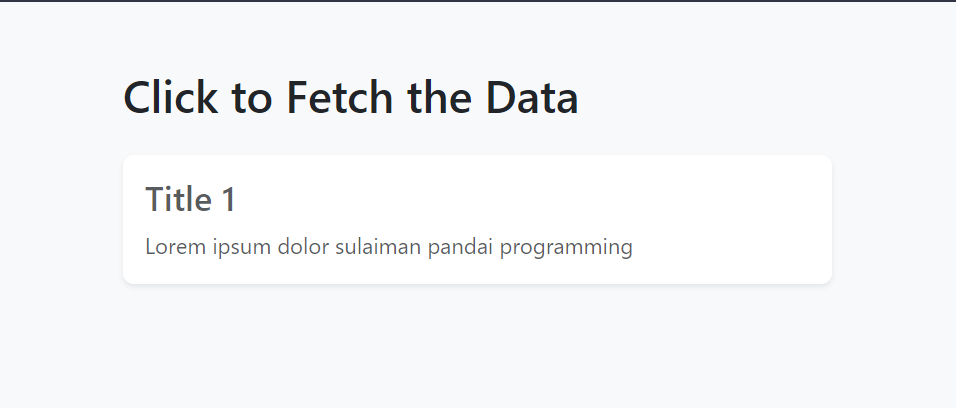

# Training ground for HTMX and PHP

Welcome to my training ground where we explore the synergy between HTMX and PHP to create dynamic and efficient web applications. 🚀🚀

## Overview

This repository serves as a playground for experimenting with the integration of HTMX, a powerful JavaScript library, with the robust backend capabilities of PHP. As a PHP Developer, I aim to implement the best coding approaches to boost productivity, enhance output efficiency, and increase profits.

## Features

- **Dynamic Content Retrieval**: Utilize HTMX to dynamically fetch and display data from PHP backend.
- **PDO Database Connection**: Establish a secure and efficient connection to the database using PHP's PDO.
- **Structured Code**: The codebase is organized to facilitate easy understanding and future enhancements.

## Getting Started

1. Clone the repository.
2. Set up your PHP environment.
3. Explore the examples and experiment with the HTMX and PHP integration.

## Example

## My Personal Comment

After playing with HTMX and PHP around 2 hours, I can say that HTMX makes my life easier compared than using jQuery AJAX. Where I don't need to code a very long process (you know what I meant). I just need to use HTML attributes to make it works. But for more robust UI, you need to inject a custom JavaSCript code.
